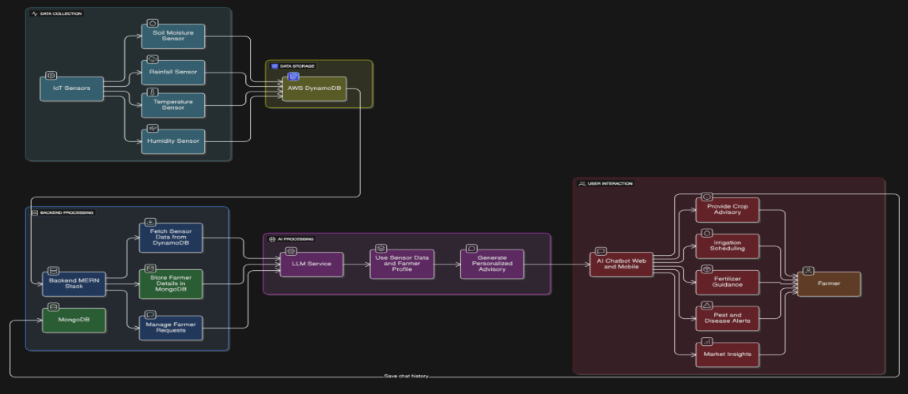

## Multi-Agent Powered Smart Farming Assistant

Multi-Agent Powered Smart Farming Assistant is a full-stack web application that enables farmers to authenticate securely, chat with an AI crop advisory agent, and manage a simple farmer profile. The product focuses on fast onboarding, low-latency chat, and a clean UX across mobile and desktop.

This system is composed of three repositories:

- `Frontend` — React (Vite + TypeScript) single-page application for Authentication, Chat, and Farmer Profile pages.  
  Repository: https://github.com/sp4m-08/sih-crop-frontend

- `Backend` — Node.js/Express API with MongoDB for authentication, profiles, sessions, and conversations.  
  Repository: https://github.com/sp4m-08/sih-crop-backend

- `Crop Chat Agent (AI Advisory Service)` — FastAPI + LangGraph powered multi-agent agricultural intelligence backend supporting weather forecasts, market prices, crop health analysis, disease prediction, and short-term farming planning.  
  Repository: https://github.com/Keshavgoyal14/crop-chat-agent

### Product Description

The Multi‑Agent Powered Smart Farming Assistant is a farmer‑first digital companion that turns scattered agricultural information into simple, timely decisions. It combines a fast, mobile‑friendly web experience with a secure backend to let farmers authenticate, chat with an AI advisory agent, and maintain a living profile that personalizes guidance over time.

- Problem it solves: Farmers struggle to find reliable, localized, and actionable advice quickly. Market prices, weather, crop health signals, and best practices are fragmented across sources, and reaching an expert is slow or costly.
- What it does: The assistant delivers instant, conversational guidance tailored to each farmer’s profile and recent interactions—so they can decide what to plant, when to irrigate, which inputs to use, and how to respond to pests or disease signals.
- Why it’s different: The product focuses on speed to insight, not just information. Conversations are remembered, advice becomes more contextual with every interaction, and the interface stays lightweight for rural connectivity.

#### Who it’s for

- Small to mid‑size farmers seeking quick, practical decisions
- FPOs, cooperatives, or agri‑advisory programs scaling expert support
- Agri‑startups needing a white‑labeled advisory front‑end

#### Core Value Propositions

- Personalized advisory: Guidance adapts to the farmer’s location, preferred crops, and farm size.
- Instant answers: AI agent responds in seconds with concise, actionable steps instead of generic articles.
- Trust and continuity: Authenticated profiles and saved sessions preserve context across visits.
- Low‑friction UX: Minimal steps from login to first helpful answer; optimized for low‑end devices.

#### Key Features

- Authentication: Simple signup/login, secure sessions, and protected access to private data.
- AI Chat Advisory: Conversational interface for questions on irrigation, fertilizer guidance, pest/disease alerts, market insights, and crop planning.
- Farmer Profile: Structured profile capturing location, preferred crops, and farm size to contextualize recommendations.
- Session Memory: Conversations and sessions are persisted so follow‑ups feel natural and cumulative.
- Performance & Reliability: Fast response times, resilient API error handling, and predictable behavior on spotty networks.

#### Typical Journeys

- New farmer onboarding: Create an account → set basic profile → ask first question → receive a clear, step‑by‑step recommendation.
- Ongoing advisory: Return to chat → get follow‑up advice that references past queries and current profile → update profile when crops or acreage change.
- Seasonal planning: Before a season, set preferred crops → ask about sowing windows, irrigation schedules, and input planning → receive a tailored checklist.

#### Product Outcomes

- Faster decision‑making: Reduce time‑to‑first‑useful‑answer from minutes to seconds.
- Better consistency: Recommendations are structured, reproducible, and aligned to the farmer’s context.
- Higher engagement: Conversational format encourages frequent, incremental guidance rather than one‑off consultations.

#### Privacy & Security

- User data is protected by modern authentication and token‑based access control.
- Only essential profile fields are collected to personalize advice.
- Data handling follows a minimal‑privilege approach and can align with institutional compliance needs.

#### Extensibility

- New advisory domains: Soil health, post‑harvest handling, input procurement, subsidy discovery.
- Localization: Multilingual UI and region‑specific agronomic playbooks.
- Integrations: Weather providers, satellite indices, or government market data to enrich insights.

#### Success Metrics

- Time to first helpful response
- Session completion rate (received and acted on a recommendation)
- Repeat usage per farmer per week
- Profile completeness and updates over time

---

### 1) Features

- Authentication: email/password registration and login using JWT
- Chat: secure conversation with an external LLM agent; messages and sessions are persisted
- Farmer Profile: create, view, and update location, preferred crop, and farm size
- Protected APIs: auth middleware guards private routes
- CORS setup for local dev and hosted frontend

---

### 2) Architecture

High‑level flow:

1. User signs up or logs in; backend returns a JWT
2. Frontend stores the token (in memory/local storage) and attaches it to private API calls
3. Chat page sends messages to the backend; the backend calls the external LLM API and stores both user and agent messages in MongoDB
4. Farmer Profile page reads and writes profile details via protected endpoints

If you want to embed the system diagram, save it as `docs/architecture.png` and reference it here:

```markdown

```

---

### 3) Tech Stack

- Frontend: React 19, Vite, TypeScript, React Router, Axios
- Backend: Node.js, Express 5, Mongoose 8, JWT, bcryptjs
- Database: MongoDB (Atlas or self‑hosted)

---

### 4) Project Structure

```
frontend/          # React app (Vite + TypeScript)
sih/               # Node.js/Express API + MongoDB models and routes
```

---

### 5) Getting Started

Prerequisites:

- Node.js 18+
- MongoDB instance (Atlas or local)

Clone and install dependencies:

```bash
git clone <this-repo>
cd sih-hackathon

# Backend
cd sih
npm install

# Frontend
cd ../frontend
npm install
```

---

### 6) Configuration

Create environment files before starting the apps.

Backend (`sih/.env`):

```env
MONGO_URI=mongodb+srv://<user>:<pass>@<cluster>/<db>?retryWrites=true&w=majority
JWT_SECRET=replace-with-a-strong-secret
# Optional: comma‑separated list if you want to override cors origins at runtime
ALLOWED_ORIGINS=http://localhost:5173
PORT=3000
```

Frontend (`frontend/.env`):

```env
VITE_API_URL=http://localhost:3000
```

---

### 7) Run in Development

Backend (Express API):

```bash
cd sih
npm run dev
# Server: http://localhost:3000
```

Frontend (Vite):

```bash
cd frontend
npm run dev
# App: http://localhost:5173
```

---

### 8) Frontend Pages

1. Authentication

- Sign up with username, email, password
- Login returns a JWT used for protected requests

2. Chat

- Sends user messages to the backend; backend calls the LLM agent (`/api/chat`)
- Persists sessions and messages; receives agent responses in real time (HTTP round‑trip)

3. Farmer Profile

- View and edit profile fields: `location`, `preferredCrop`, `farmSizeAcres`
- All profile operations are protected by JWT

---

### 9) API Reference (Backend)

Base URL (local): `http://localhost:3000/api`

Auth

- `POST /auth/register`
  - body: `{ username, email, password }`
  - response: `{ message, token }`

- `POST /auth/login`
  - body: `{ email, password }`
  - response: `{ message, token }`

Chat

- `POST /chat` (protected)
  - headers: `Authorization: Bearer <token>`
  - body: `{ message, sessionId? }`
  - response: `{ response, sessionId }`

Profile

- `GET /profile` (protected)
  - headers: `Authorization: Bearer <token>`
  - response: full profile document

- `POST /profile` (protected)
  - body: `{ location, preferredCrop, farmSizeAcres }`
  - response: `{ message, profile }`

- `PUT /profile` (protected)
  - body: any subset of `{ location, preferredCrop, farmSizeAcres }`
  - response: `{ message, profile }`

---

### 10) Data Models (Overview)

- User
  - `username`, `email`, `password_hash`, `uid`

- Session
  - Tracks a user’s chat session and last activity timestamp

- Conversation
  - Stores each message: `senderRole` (`user` or `agent`), `content`, `indexInSession`, and `sessionId`

- FarmerProfile
  - `userId`, `location`, `preferredCrop`, `farmSizeAcres`

---

### 11) Security Notes

- JWT used for all private endpoints; tokens expire (default 1h)
- Passwords stored with bcrypt
- CORS restricted to known origins (update in `server.js` or via `ALLOWED_ORIGINS`)

---

### 12) Production Tips

- Use environment variables for secrets and URLs
- Enable HTTPS and secure cookies if moving tokens to cookies
- Add request rate limiting (e.g., `express-rate-limit`) and input validation (`zod`/`joi`)
- Configure proper indexes on MongoDB collections for sessions/conversations

---

### 13) Troubleshooting

- 401 Unauthorized: ensure the `Authorization: Bearer <token>` header is present
- Cannot connect to MongoDB: verify `MONGO_URI` and IP allowlist
- CORS error in browser: add your frontend origin to allowed origins
- LLM agent errors: confirm the external LLM API URL is reachable

---

### 14) Scripts

Backend:

```bash
npm run dev   # nodemon server.js
npm start     # node server.js
```

Frontend:

```bash
npm run dev
npm run build
npm run preview
```

---

### 15) License

MIT (update as needed)
